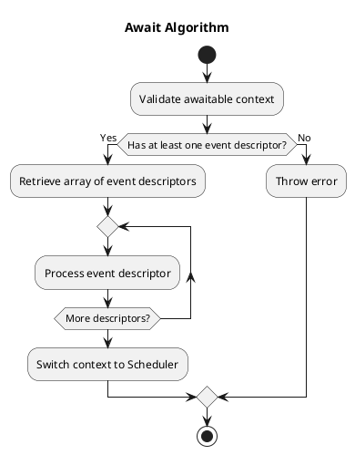
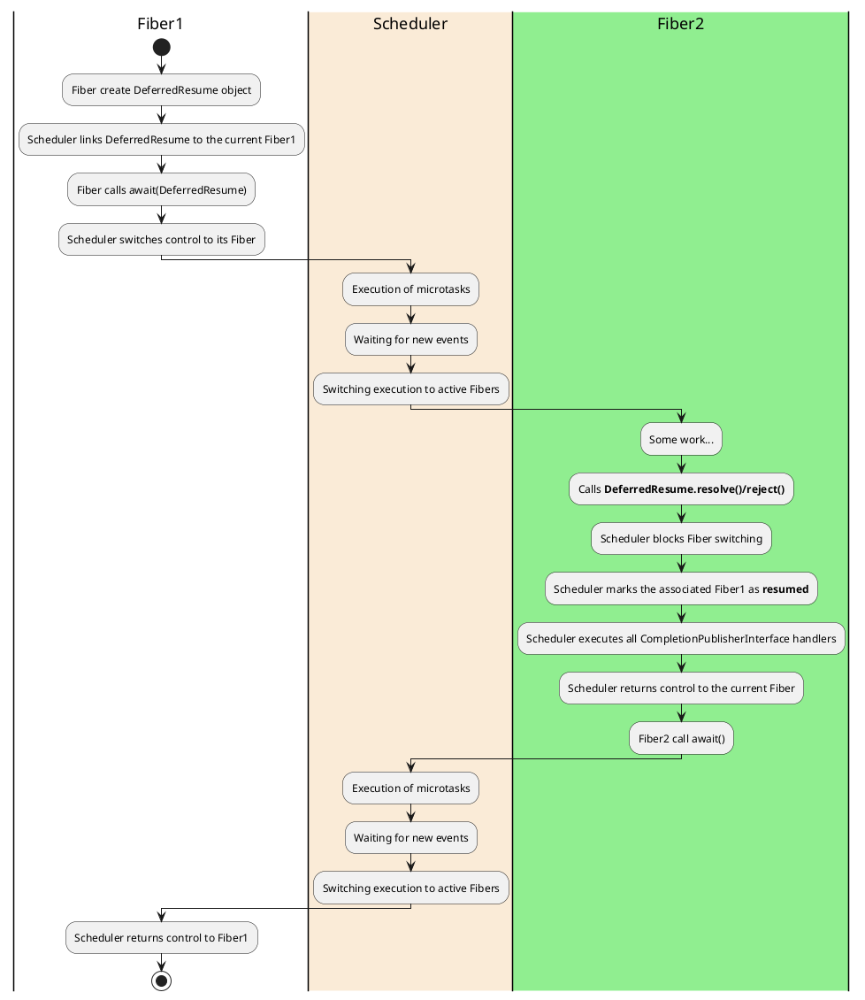

# Implementation

## Event descriptors

The `Async` component is based on low-level `event descriptors` 
that cannot be implemented at the user-mode level.

An `event descriptor` is an object that describes an event that can occur in the system.
The `Async` library implements the following event descriptors:

* `InputOutputEvent`  - an event for handling input/output
* `TimerEvent`        - an event for handling timers
* `SignalEvent`       - an event for handling signals
* `FileSystemEvent`   - an event from the file system
* `ProcessEvent`      - an event related to processes
* `ThreadEvent`       - an event related to threads

## DeferredResume

The key class of the library for implementing `Fiber` switching is the `DeferredResume` class.

```php
use Async\Deferred;
use Async\FutureInterface;

final class DeferredResume implements DeferredInterface
{
}
```

The `DeferredResume` class describes an awaitable context 
whose resolution indirectly leads to calling the `Fiber::resume()` method.

The `DeferredResume` class requires adherence to the following usage rules:

* A `DeferredResume` object must be created only within the `Fiber` it is intended to resume.
* The `resolve()` and `reject()` methods can be called from user-mode in any `Fiber`.

The following low-level interfaces/classes manage what happens during event processing:

* `EventDescriptorInterface`: Implements an event descriptor and handler that is invoked when the event occurs.
* `DeferredResolverInterface`: Implements the logic for resolving a `Deferred`. 
This interface is typically implemented by `Event objects` that transition the state 
of the `Event` to the state of a Deferred. 

The following classes implement both of these interfaces:

* `InputOutputEvent`  - an event for handling input/output
* `TimerEvent`        - an event for handling timers
* `SignalEvent`       - an event for handling signals
* `FileSystemEvent`   - an event from the file system
* `ProcessEvent`      - an event related to processes
* `ThreadEvent`       - an event related to threads 

Using these primitives, you can create any awaitable context with unique logic.
Let's consider this with an example: `AwaitTimeout`:

```php

use Async\DeferredResume;

final readonly class AwaitTimeout implements AwaitableInterface
{
    private TimerEvent $event;

    public function __construct(int $timeout)
    {
        $this->event = new TimerEvent($timeout, new DeferredResume());
    }
    
    public function getWaitingEvents(): array
    {
        return [$this->event];
    }
}

```

In this example, a `Timer` event descriptor is created, 
which resolves a `DeferredResume` when the timer triggers. 
This is the simplest example of using primitives.

Now, let's consider a more complex example: waiting for read/write operations.

```php

use Async\DeferredResume;

final readonly class AwaitSocket implements AwaitableInterface
{
    private InputOutputEvent $event;
    private TimerEvent $timeout;

    public function __construct(Socket $socket, int $events, int $timeout = 0)
    {
        $this->deferred = new DeferredResume();
        $this->event    = new InputOutputEvent($stream, $events, $this->deferred);
        $this->timeout  = null;
        
        if ($timeout > 0) {            
            $this->timeout  = new TimerEvent($timeout, $this->deferred);
            $this->timeout->thenIgnore($this->event);
        }
    }
    
    public function getDeferredResume(): DeferredResume
    {
        return $this->deferred;
    }    
    
    public function getWaitingEvents(): array
    {
        return [$this->event, $this->timeout];
    }
}
```

## AwaitContext

The `await(AwaitableInterface $context)` method is a method that triggers context switching between
`Fibers`. It is the primary and only way to transfer control between `Fibers`, unlike low-level methods.

`AwaitContext` is a high-level object that can be implemented by a `PHP` developer and encapsulates the following:

* A DeferredResume object that must be resolved within the `AwaitContext` code.
* A list of events that the `Fiber` should wait for.
* The logic linking the events to the `DeferredResume`.

When a `AwaitContext` is created and passed to the `await()` method,
it is automatically associated with the current `Fiber`,
and the `Fiber` is suspended, transferring control to the `Fiber Scheduler`.

A `Fiber` can have only one `AwaitContext` at any given time.
This limitation has several important implications:

* When a `Fiber` is waiting for something, the `Scheduler` knows exactly what it is waiting for.
* If an exception needs to be thrown into the waiting `Fiber`,
  it will automatically cause the await object to transition to its final state.


## Await Algorithm

The `await()` method validates the correctness of the awaitable context. 
The awaitable context must have at least one event descriptor.
The `await()` method retrieves an array of event descriptors and processes them one by one.
The `await()` method switches the context to the `Scheduler`.



The `Scheduler` processes the event descriptors in the following way:

Async adds callbacks to the event loop based on the type of descriptor 
and sets up a handler so that it invokes the descriptor's `handle()` method, 
passing additional event data that may vary depending on the type of event.

## User-mode AwaitContexts

To implement `User-mode` waiting objects, the `Async` library defines the `DeferredResume` class, 
which implements the methods:


As soon as the `DeferredResume` class is created, 
it is immediately linked to the current `Fiber`. 
From that moment, the user can resolve or reject it.

The `DeferredResume` class is a fundamental primitive for implementing `Promise` and `Channel`.

### DeferredResume resolution handling

When a `DeferredResume` is resolved, it calls the internal method `Scheduler::resumeFiber()`, 
which instructs the scheduler to queue the Fiber for execution.

The Scheduler immediately invokes all CompletionPublisherInterface 
handlers that cannot switch fibers or perform asynchronous operations. 
If this happens, a fatal exception is thrown.

Then the `Scheduler` return control to the current `Fiber` without a context switch.



## Persistent Await Context

It is often necessary to implement interaction with the `event loop` within a cycle. 
If a new `await context` is created and then destroyed each time, 
it can lead to unnecessary overhead. 
Additionally, event descriptors will repeatedly be removed from and added to the `EventLoop`, 
which can also negatively impact performance.

A persistent await context helps avoid unnecessary memory allocation operations and the addition of event descriptors.

In this case, the `Fiber` creates a persistent await context and is required to pass it again 
or NULL to the await method.

The `Scheduler` does not delete the await context after the `Fiber` is activated 
but continues monitoring the events.